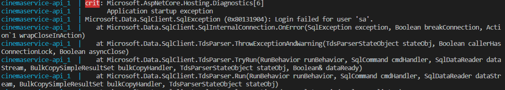

# CinemaService

## What is this project?
This is a service which can give an information like Get Available cinema shows, Get Available seats of the show and also to book the show. These are API calls and it is using Docker to run the service.

## Pre-requisite

- Should have docker installed locally

## Database Design And Decision

Using sql server to build the data store because there is a relational information which needs to be stored and fetched

### Database Design

#### CinemaShow Table

| Id(PK) |   Name   | IsAvailable |
| ------ | :------: | ----------: |
| 1      | Avengers |           1 |
| 2      |   Hulk   |           1 |
| 3      |   Nest   |           0 |

#### Seat Table

| Id(PK) | SeatNumber |
| ------ | :--------: |
| 1      |    A10     |
| 2      |    B10     |
| 3      |    C10     |

#### Booking Table

| Id(PK) | CinemaShowId | SeatId | IsBooked |
| ------ | :----------: | :----: | -------: |
| 1      |      1       |   1    |        1 |
| 2      |      1       |   2    |        1 |
| 3      |      2       |   3    |        1 |

## Supported APIs

### Get Available Shows

http://localhost:8080/api/v1/cinema/GetAvailableCinemaShows

### Get Available Show Seats

http://localhost:8080/api/v1/cinema/GetAvailabelSeats/{ShowName}

### Book Show

http://localhost:8080/api/v1/cinema/booking/{ShowName}/{SeatNumber}

## Design Decisions

- Converted service into 3 modules, DataLayer, Web.Api and Web.Api.Library
- Using repository pattern to get entities from the database
- Using service pattern to communicate between different project

## Unit Tests and Integration Tests

- For unit tests used mocks
- For integration tests used in memory database

## How to Run

- Clone the repository
- Navigate to the path
- Run command `docker-compose up`

```
   > Note: If you see following error message in logs rerun coomand `docker-compose up`

```



# To improve

- Paging can be implemented
